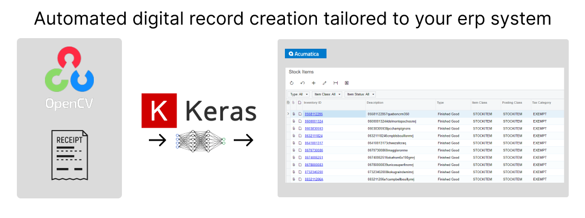

# Machine vision for ERP document creation
Example script for creating documents in acumatica from images of receipts.
This project uses a combination of open cv and machine learning to segment an image, and interpret them as caracheters.

